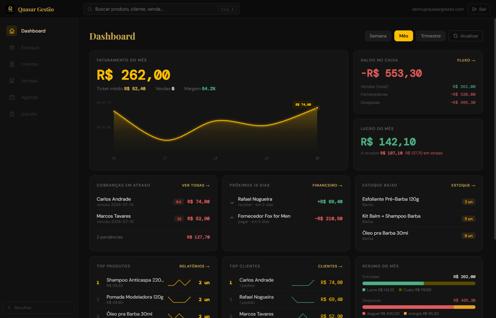
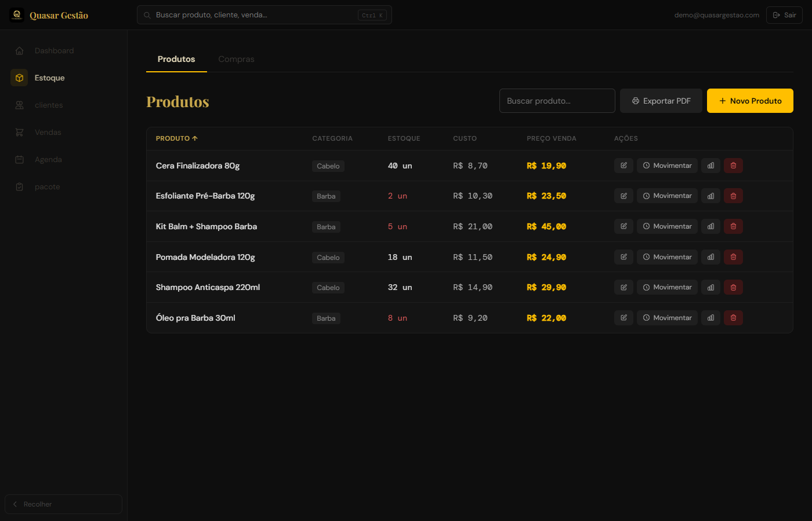
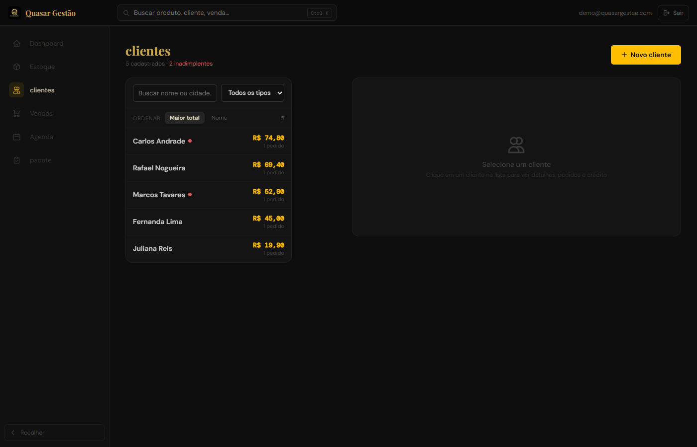

# Quasar Gestão

Sistema de gestão para barbearias e distribuidores B2B do setor — controle de vendas, estoque, financeiro e clientes, com evolução em andamento para SaaS multi-tenant (múltiplas barbearias na mesma base, com planos de assinatura).

Projeto real em produção, usado no dia a dia da Quasar Barber (distribuidora de produtos de barba/cabelo).

## O que o sistema faz

- **Dashboard** — faturamento, saldo em caixa, lucro do mês, cobranças em atraso, estoque baixo, comparativo com mês anterior
- **Vendas** — registro de vendas com múltiplas formas de pagamento (à vista, cartão, PIX, fiado)
- **Contas a receber** — cobranças pendentes, vencidas e pagas, com alerta automático de inadimplência
- **Estoque** — controle de produtos e quantidades
- **Clientes** — cadastro e histórico por cliente
- **Relatórios** — vendas e inadimplência
- **Multi-tenant** — onboarding automatizado de novas barbearias, com planos de assinatura (núcleo, quasar pro, constelação) e gating de features por plano

## Stack

- **Frontend:** React 19 (Create React App), sem TypeScript, sem framework CSS (estilização 100% inline)
- **Backend:** Supabase (Postgres + Auth)
- **Deploy:** Vercel

## Prints

_Telas com dados fictícios de demonstração — sem informação real de cliente._

**Dashboard**


**Estoque**


**Clientes**


## Rodando localmente

```bash
npm install
npm start        # dev server em localhost:3000
npm run build     # build de produção
```

Requer variáveis de ambiente `REACT_APP_SUPABASE_URL` e `REACT_APP_SUPABASE_KEY` (ver `.env`, não versionado).
